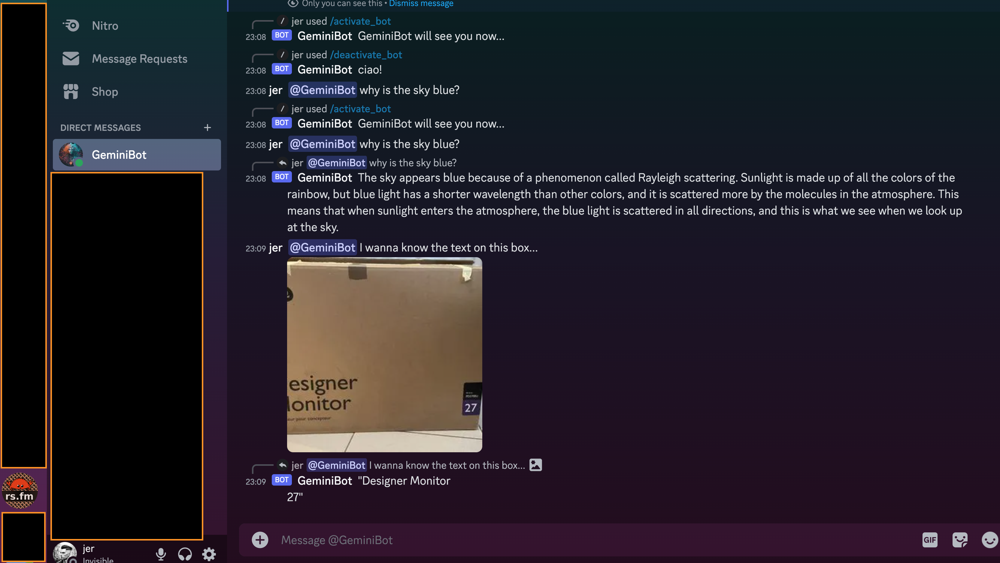

# Discord Bot Example

This is a Discord bot example that uses the [Poise crate](https://docs.rs/poise) for command handling and the [Jemini API](https://github.com/jemini/jemini) for chat generation.



## Prerequisites

- A Discord bot account with a token from Discord.
- A Gemini Ai Studio API key from Google.

## Setting Up the Discord Bot

1. Create a new Discord bot account on the [Discord Developer Portal](https://discord.com/developers/applications).
2. Navigate to the "Bot" tab and create a new bot.
3. Copy the bot token and keep it secure.

## Setting Up the Jemini API Key

1. Follow the instructions in the [Jemini README](../../README.md) to obtain a Gemini/Google AI Studio API key.
2. Store the API key in a `.env` file at the root of your project:
   > .env file

```
   GEMINI_API_KEY=your_jemini_api_key_here
   GEMINI_DISCORD_BOT=your_discord_bot_token_here
```

## Running the Bot

1. Clone this repository or copy the necessary files into your project.
2. I assume you have Rust already...
3. Navigate to the project directory and run the following command to install dependencies:
4. Run the bot:

```sh
cargo run --release
```

5. Invite the bot to your Discord server using the OAuth2 URL generated in the Discord Developer Portal.

6. Once the bot is running, you can start a chat by mentioning the bot with the command `@GeminiBot`.

## What can it do?

_not much, it's an example.._

- use `/` slash commands to activate/deactivate the bot.
- `@GeminiBot` the bot to chat.
- Uploading a photo with text will be interpreted by the GeminiPro Vision model.

## A TODO list if you wanted this sort of thing.

> _I'll probs merge any of this if anyone wants to implement it_

1. ~~**Implement Activation and Deactivation Commands**: Create slash commands to activate and deactivate the bot. This will allow users to control the bot's functionality without affecting the codebase.~~

2. ~~**Refactor Event Handling**: Modify the event handler to check the `ACTIVE` state before processing events. This will prevent the bot from responding when it's deactivated.~~

3. **Handle Existing Chats**: Implement functionality to handle existing chats when a user interacts with the bot. This will ensure that the bot can maintain context and provide relevant responses.

4. **Long-Lived Chats and History Management**: Develop a system to manage long-lived chats and their history. This will allow the bot to remember past interactions and provide more coherent responses over time.

5. **Error Handling**: Improve error handling throughout the bot's code to ensure that it can gracefully handle unexpected situations and provide useful feedback to users.

6. **Testing**: Write comprehensive tests for the bot's functionality to ensure that it behaves as expected and to catch any regressions introduced during development.

7. **Documentation**: Update the README and other documentation to reflect the current state of the bot and its features. This will help users understand how to use the bot and what to expect from it.

8. **Performance Optimization**: Review the bot's performance and identify any potential bottlenecks or areas for improvement. This may include optimizing the event handling loop or the way the bot interacts with external services.

9. **Security Review**: Conduct a security review of the bot's code and its interactions with external services to ensure that it is secure and that user data is handled appropriately.

10. **User Interface**: Consider implementing a user interface for the bot, such as a web dashboard or a more interactive chat interface, to improve the user experience.

11. **Logging and Monitoring**: Set up logging and monitoring to track the bot's performance and usage. This will help with debugging and understanding how the bot is being used in practice.

12. **Deployment and Continuous Integration**: Set up a deployment pipeline and continuous integration/continuous deployment (CI/CD) system to automate the process of updating and deploying the bot.

13. **Scalability**: Design the bot with scalability in mind, ensuring that it can handle an increasing number of users and interactions without performance degradation.

14. **Internationalization**: If the bot will be used in multiple regions or languages, consider implementing internationalization to support different languages and locales.

15. **Accessibility**: Ensure that the bot is accessible to users with disabilities by following accessibility best practices and guidelines.
